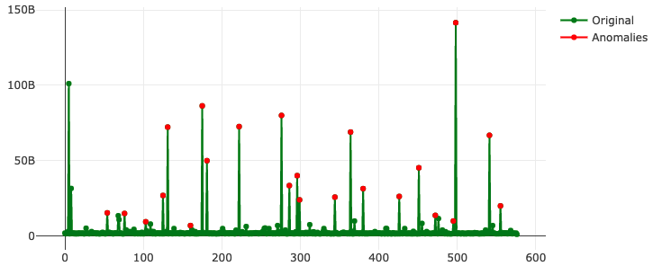

# Forta Anomalous Gas Usage Agent

## Description

<p align="center">
  
</p>

This agent helps to detect unusual high gas usage for specific protocols.
At the moment, the agent analyses only the value of `priorityFeePerGas` ([EIPS-1559](https://eips.ethereum.org/EIPS/eip-1559)),
which is calculated according the following formula:

```
priorityFeePerGas = min(transaction.maxPriorityFeePerGas, transaction.maxFeePerGas - block.baseFeePerGas)
```

[Holt-Winters Forecasting](https://otexts.com/fpp2/holt-winters.html) is used to detect anomalous values.
The analyzer starts checking transactions as soon as it has enough training data,
which it collects during 2 (seasons) * 7 (days) * 24 (hours) = 332 hours.

Also, the agent has a fairly powerful system of working with analysers, but at the moment, only one is available (Holt-Winters).

---

To see live how the algorithm works with different protocols and data, see [research folder](./research).
The demo server can be started with the command:

```bash
cd ./research/
npm run start
```

## Supported Chains

EVM-compatible chains

## Features

- Support for multiple analysers
- Support for protocol-specific configurations
- Values interpolation (missing values in the intervals)
- Noise values filtering to improve prediction accuracy
- Demo server with real-world data

## Alerts

- KOVART-ANOMALOUS-PRIORITY-FEE-HOLT-WINTERS
  - Fired when a transaction actual `priorityFeePerGas` is greater the predicted by more than 300%
  - Severity is always set to "medium"
  - Type is always set to "suspicious"
  - metadata:
    - `sender` - sender address
    - `actualPriorityFeePerGas` - actual value
    - `expectedPriorityFeePerGas` - predicted value

## Test Data

The agent behaviour can be checked in the [demo project](./research).

Since [default config](./agent-config.json) contains Ronin Bridge contract, 
the following command catch [the Ronin Hack](https://forta.org/blog/ronin-hack/):

```bash
npm run range 14342885..14442835
```
